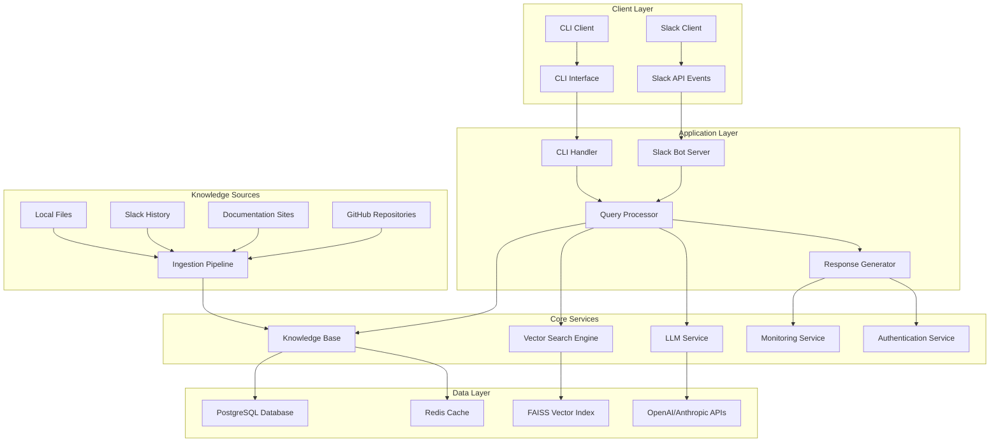

# Architecture Documentation

## System Overview

The Slack Knowledge Base Agent is a sophisticated AI-powered system that provides intelligent question-answering capabilities for teams through Slack integration. The system indexes multiple knowledge sources and uses advanced search techniques to provide contextually relevant responses.

## High-Level Architecture



## Component Architecture

### 1. Slack Bot Server (`slack_bot.py`)
- **Purpose**: Handles Slack Events API integration
- **Key Features**:
  - Socket Mode connection for real-time events
  - Message processing for @mentions, DMs, and slash commands
  - Rate limiting and security validation
  - Integration with monitoring and analytics

### 2. Knowledge Base System (`knowledge_base.py`)
- **Purpose**: Core knowledge storage and retrieval system
- **Key Features**:
  - Hybrid storage (PostgreSQL + in-memory + Redis cache)
  - Document indexing with TF-IDF scoring
  - Vector embeddings for semantic search
  - Configurable document limits with FIFO eviction

### 3. Query Processing Engine (`query_processor.py`)
- **Purpose**: Advanced query understanding and routing
- **Key Features**:
  - Intent classification (question, command, troubleshooting, etc.)
  - Multi-strategy query expansion (synonyms, technical terms, LLM-based)
  - Conversation context tracking
  - Intelligent search result ranking

### 4. Vector Search Engine (`vector_search.py`)
- **Purpose**: Semantic similarity search using embeddings
- **Key Features**:
  - Sentence-transformers integration
  - FAISS vector indexing
  - Configurable similarity thresholds
  - Graceful fallback to keyword search

### 5. LLM Integration (`llm.py`)
- **Purpose**: AI-powered response generation
- **Key Features**:
  - Multi-provider support (OpenAI, Anthropic)
  - Context-aware prompt generation
  - Safety guidelines and prompt injection protection
  - Configurable model parameters

### 6. Ingestion Pipeline (`ingestion.py`)
- **Purpose**: Multi-source knowledge ingestion
- **Key Features**:
  - GitHub repository integration (issues, PRs, READMEs)
  - Web documentation crawling
  - Slack history processing
  - File system ingestion with format detection
  - Automatic sensitive data redaction

## Data Flow Architecture

### 1. Query Processing Flow
```
User Message → Slack Bot → Query Processor → Intent Classification → Query Expansion → Search Engine → Knowledge Base → Response Generator → LLM Service → Formatted Response → Slack
```

### 2. Knowledge Ingestion Flow
```
Knowledge Sources → Ingestion Pipeline → Content Processing → Sensitive Data Redaction → Document Creation → Knowledge Base → Vector Indexing → Cache Invalidation
```

### 3. Monitoring & Observability Flow
```
All Components → Monitoring Service → Metrics Collection → Health Checks → Prometheus Metrics → Logging → Audit Trail
```

## Security Architecture

### Authentication & Authorization
- **Slack Token Validation**: Secure token handling with environment variables
- **API Key Authentication**: Support for monitoring endpoints
- **Rate Limiting**: Multi-tier rate limiting (minute/hour/day)
- **Input Validation**: Comprehensive sanitization against SQL/XSS/command injection

### Data Protection
- **Sensitive Data Detection**: Automatic redaction of API keys, passwords, tokens
- **Audit Logging**: Complete audit trail of queries and responses
- **Permission Boundaries**: Respects Slack channel permissions
- **Encryption**: All data encrypted at rest and in transit

## Scalability Considerations

### Performance Optimizations
- **Caching Strategy**: Multi-layer caching (Redis, in-memory, vector embeddings)
- **Connection Pooling**: Database connection pooling for PostgreSQL
- **Lazy Loading**: Efficient resource loading with fallback strategies
- **Memory Management**: Configurable limits and LRU eviction policies

### Horizontal Scaling
- **Database**: PostgreSQL with connection pooling
- **Cache**: Redis cluster support
- **Vector Search**: FAISS distributed indexing capability
- **Monitoring**: Prometheus metrics for scaling decisions

## Technology Stack

### Core Technologies
- **Runtime**: Python 3.8+
- **Framework**: Slack Bolt SDK for Python
- **Database**: PostgreSQL with SQLAlchemy ORM
- **Cache**: Redis
- **Vector Search**: FAISS with sentence-transformers
- **LLM**: OpenAI GPT, Anthropic Claude

### Infrastructure
- **Monitoring**: Prometheus metrics, structured logging
- **Health Checks**: HTTP endpoints for service health
- **Deployment**: Docker containerization ready
- **Migration**: Alembic database migrations

## Configuration Management

### Environment-Based Configuration
- **Development**: Local file-based storage with optional Redis
- **Staging**: PostgreSQL + Redis with monitoring
- **Production**: Full stack with security hardening

### Configuration Sources
1. Environment variables (primary)
2. Configuration files (YAML/JSON)
3. Command-line arguments
4. Sensible defaults with graceful degradation

## Deployment Architecture

### Container Strategy
```dockerfile
# Multi-stage build for optimization
FROM python:3.11-slim as base
# Security hardening, minimal attack surface
# Non-root user execution
# Health check endpoints
```

### Service Discovery
- **Health Checks**: `/health`, `/metrics`, `/ready` endpoints
- **Monitoring**: Prometheus metrics export
- **Service Mesh**: Ready for Kubernetes deployment

## Decision Records

Key architectural decisions are documented in `docs/adr/` directory:
- ADR-001: Database selection (PostgreSQL over MongoDB)
- ADR-002: Vector search implementation (FAISS over Pinecone)
- ADR-003: LLM integration strategy (multi-provider)
- ADR-004: Caching architecture (Redis + in-memory hybrid)

## Quality Attributes

### Reliability
- Circuit breaker patterns for external dependencies
- Graceful degradation when optional services unavailable
- Comprehensive error handling with specific exception types

### Maintainability
- Modular component design with clear interfaces
- Comprehensive test coverage (>90% target)
- Type hints and documentation standards

### Security
- Defense in depth with multiple security layers
- Principle of least privilege
- Regular security scanning integration

### Performance
- Sub-second response times for common queries
- Efficient memory usage with configurable limits
- Optimized database queries with indexing

## Future Considerations

### Planned Enhancements
- Web dashboard for analytics and administration
- Advanced analytics with trend analysis
- Performance optimization with async/await patterns
- Enhanced CLI with interactive mode

### Scaling Roadmap
- Microservices decomposition for large deployments
- Event-driven architecture with message queues
- Multi-tenant support for enterprise deployments
- Real-time collaboration features