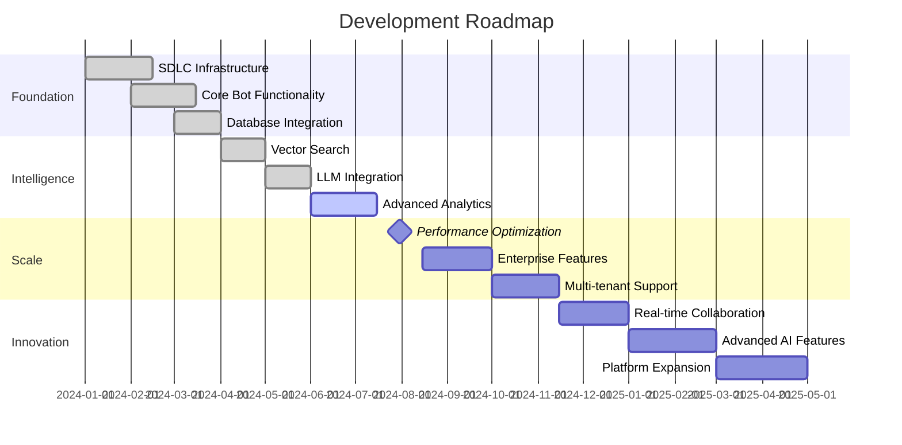

# Slack KB Agent - Product Roadmap

## Current Version: 1.7.2

This roadmap outlines the strategic direction and planned enhancements for the Slack Knowledge Base Agent.

## Roadmap Overview

## 🎯 Current Focus (Q3 2024)

### Performance & Reliability
**Status**: In Progress
- [ ] Query response time optimization (target: <1s for 95% of queries)
- [ ] Memory usage optimization and leak prevention
- [ ] Database query optimization with connection pooling
- [ ] Cache strategy improvements (Redis + in-memory hybrid)
- [ ] Circuit breaker implementation for external dependencies

### Advanced Analytics & Insights
**Status**: Active Development
- [ ] Usage trend analysis and reporting
- [ ] Knowledge gap identification algorithms
- [ ] User behavior analytics and personalization
- [ ] Popular content recommendations
- [ ] Team productivity impact metrics

## 🚀 Near Term (Q4 2024)

### Enterprise-Grade Features
**Priority**: High
- [ ] Multi-tenant architecture support
- [ ] Advanced access control and permissions
- [ ] Enterprise authentication (SSO, LDAP)
- [ ] Compliance reporting and audit trails
- [ ] Data residency and regional deployment options

### Enhanced Integration Capabilities
**Priority**: Medium
- [ ] Microsoft Teams integration
- [ ] Jira/Linear issue tracking integration
- [ ] Confluence/Notion documentation sync
- [ ] Calendar integration for meeting context
- [ ] Email integration for knowledge capture

### Developer Experience Improvements
**Priority**: High
- [ ] Interactive CLI with auto-completion
- [ ] Web-based administration dashboard
- [ ] GraphQL API for custom integrations
- [ ] Webhook system for real-time updates
- [ ] Plugin architecture for custom extensions

## 🌟 Medium Term (Q1-Q2 2025)

### Advanced AI Capabilities
**Status**: Research Phase
- [ ] Fine-tuned models for domain-specific knowledge
- [ ] Multi-modal support (images, documents, videos)
- [ ] Conversation summarization and meeting notes
- [ ] Proactive knowledge suggestions
- [ ] Natural language to query translation

### Real-time Collaboration Features
**Status**: Planning
- [ ] Live document annotation and comments
- [ ] Collaborative knowledge editing
- [ ] Real-time question/answer sessions
- [ ] Team knowledge sharing workflows
- [ ] Expert identification and routing

### Platform Expansion
**Status**: Evaluation
- [ ] Discord bot integration
- [ ] WhatsApp Business integration
- [ ] Mobile app for knowledge access
- [ ] Browser extension for web research
- [ ] API marketplace integrations

## 🔬 Long Term (Q3-Q4 2025)

### Innovation & Research
**Status**: Conceptual
- [ ] Autonomous knowledge curation
- [ ] Predictive question answering
- [ ] Cross-team knowledge sharing networks
- [ ] AI-powered documentation generation
- [ ] Voice interaction capabilities

### Ecosystem Development
**Status**: Planning
- [ ] Third-party integration marketplace
- [ ] Community-driven knowledge sources
- [ ] Open-source plugin ecosystem
- [ ] Knowledge sharing between organizations
- [ ] Industry-specific knowledge templates

## 📊 Success Metrics & KPIs

### User Adoption & Engagement
- **Current**: 70% team adoption rate
- **Target Q4 2024**: 90% team adoption rate
- **Target Q2 2025**: 95% team adoption rate

### Performance Benchmarks
- **Response Time**: <3s (current) → <1s (Q4 2024) → <500ms (Q2 2025)
- **Accuracy Rate**: 85% (current) → 92% (Q4 2024) → 95% (Q2 2025)
- **Knowledge Coverage**: 80% (current) → 95% (Q4 2024) → 98% (Q2 2025)

### Business Impact
- **Support Ticket Reduction**: 40% (current) → 60% (Q4 2024) → 75% (Q2 2025)
- **Onboarding Time**: 2 weeks (current) → 1 week (Q4 2024) → 3 days (Q2 2025)
- **Documentation Usage**: 300% increase (current) → 500% (Q4 2024) → 700% (Q2 2025)

## 🏗️ Technical Roadmap

### Architecture Evolution
1. **Monolithic → Modular** (Q3 2024)
   - Component-based architecture
   - Plugin system foundation
   - API-first design

2. **Single-tenant → Multi-tenant** (Q4 2024)
   - Tenant isolation and security
   - Resource sharing and optimization
   - Centralized management

3. **Reactive → Proactive** (Q1 2025)
   - Event-driven architecture
   - Real-time processing
   - Predictive capabilities

### Infrastructure Scaling
- **Database**: PostgreSQL → PostgreSQL cluster → Multi-region setup
- **Cache**: Redis → Redis cluster → Distributed caching
- **Search**: FAISS → Distributed FAISS → Hybrid cloud search
- **Deployment**: Docker → Kubernetes → Multi-cloud orchestration

## 💡 Innovation Opportunities

### Emerging Technologies
- **Large Language Models**: GPT-4, Claude, Llama integration
- **Vector Databases**: Pinecone, Weaviate, Chroma evaluation
- **Knowledge Graphs**: Neo4j, Amazon Neptune for relationship mapping
- **Edge Computing**: Local deployment for data sensitivity
- **Federated Learning**: Collaborative model improvement

### Research Areas
- **Retrieval-Augmented Generation (RAG)**: Enhanced context understanding
- **Few-shot Learning**: Rapid adaptation to new domains
- **Multimodal AI**: Understanding images, audio, video content
- **Explainable AI**: Better answer provenance and reasoning
- **Conversational AI**: More natural dialogue interactions

## 🎯 Strategic Priorities

### 2024 Focus Areas
1. **Performance & Reliability**: Ensure production-ready stability
2. **Enterprise Readiness**: Security, compliance, scalability
3. **User Experience**: Intuitive interactions, fast responses
4. **Knowledge Quality**: Accuracy, relevance, freshness

### 2025 Focus Areas
1. **AI Innovation**: Cutting-edge ML capabilities
2. **Platform Expansion**: Multi-channel presence
3. **Ecosystem Growth**: Partner integrations, marketplace
4. **Global Scale**: Multi-region, multi-language support

## 📅 Release Schedule

### Quarterly Releases
- **Q3 2024**: Performance & Analytics Release
- **Q4 2024**: Enterprise & Integration Release
- **Q1 2025**: AI & Collaboration Release
- **Q2 2025**: Platform & Ecosystem Release

### Monthly Updates
- Performance improvements and bug fixes
- Security updates and patches
- New integration capabilities
- User experience enhancements

## 🤝 Community & Ecosystem

### Open Source Strategy
- Core components open-sourced for community contribution
- Plugin development framework and documentation
- Community-driven integration marketplace
- Regular hackathons and contribution events

### Partner Ecosystem
- Integration partnerships with major SaaS providers
- Technology partnerships with AI/ML companies
- Channel partnerships for enterprise distribution
- Academic partnerships for research collaboration

---

**Next Review**: Quarterly roadmap reviews with stakeholder feedback
**Contact**: Product team for roadmap questions and feature requests
**Last Updated**: August 2024